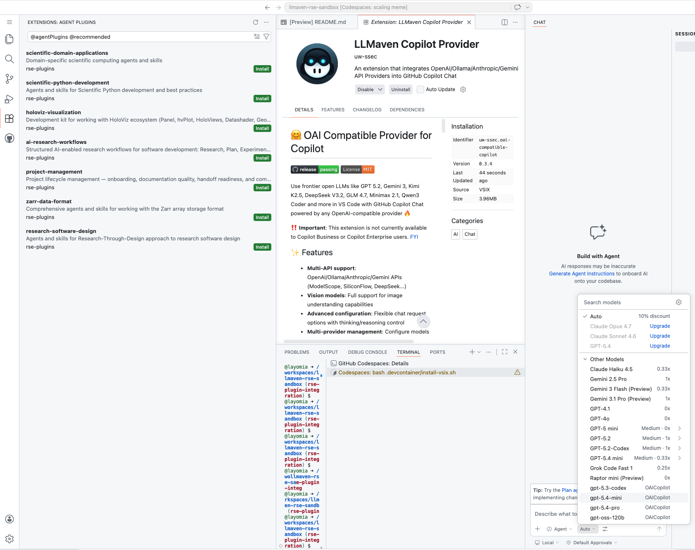

# llmaven-rse-sandbox

This repository contains the sandbox environment for the NAIRR RSE Plugins Demo.

It provides a preconfigured GitHub Codespaces workspace where authorized users can evaluate Research Software Engineering (RSE) AI workflows using GitHub Copilot Chat, the LLMaven Copilot Provider extension, and the UW SSEC RSE Agent Plugins.

## What this repo provides

- A user-facing evaluation environment for RSE AI workflows
- A GitHub Codespaces sandbox with scientific Python tooling managed by Pixi
- A pinned LLMaven Copilot Provider extension for routing Copilot-compatible requests through the LLMaven / LiteLLM gateway
- Workspace recommendations for UW SSEC RSE Agent Plugins
- Guided documentation for first-time demo users

## How the pieces fit together

The sandbox uses three layers:

```text
GitHub Codespaces
  → provides the reproducible development environment

LLMaven Copilot Provider
  → routes Copilot Chat model requests through the LLMaven / LiteLLM gateway

RSE Agent Plugins
  → provide RSE-specific skills, agents, and workflows inside Copilot Chat
```

See the [three-layer sandbox view](docs/assets/sandbox-three-layer-view.png), which shows the RSE Agent Plugins list, the LLMaven Copilot Provider extension, and the Copilot Chat model picker in one VS Code workspace.



The Copilot provider extension and the RSE Agent Plugins are separate. The provider handles model routing. The plugins provide the research software engineering capabilities.

## Start here

Open this repository in GitHub Codespaces, then follow:

```text
docs/getting-started.md
```

## Saving your work

This repository is intended as a managed sandbox. Demo users should fork this repository if they want to preserve changes outside the provided environment.

See:

```text
docs/save-your-work.md
```

## Data and evaluation notes

AI interactions in this environment may be routed through the LLMaven / LiteLLM gateway for research and evaluation purposes.

See:

```text
docs/data-collection.md
```

## Trust assumptions

This sandbox installs a pinned LLMaven Copilot Provider VSIX during devcontainer setup. The VSIX is verified against a SHA256 value committed in this repository before installation.

The provider extension uses a gateway credential provisioned through the authorized onboarding flow. Use this sandbox only from trusted Codespace sessions created through that flow.
