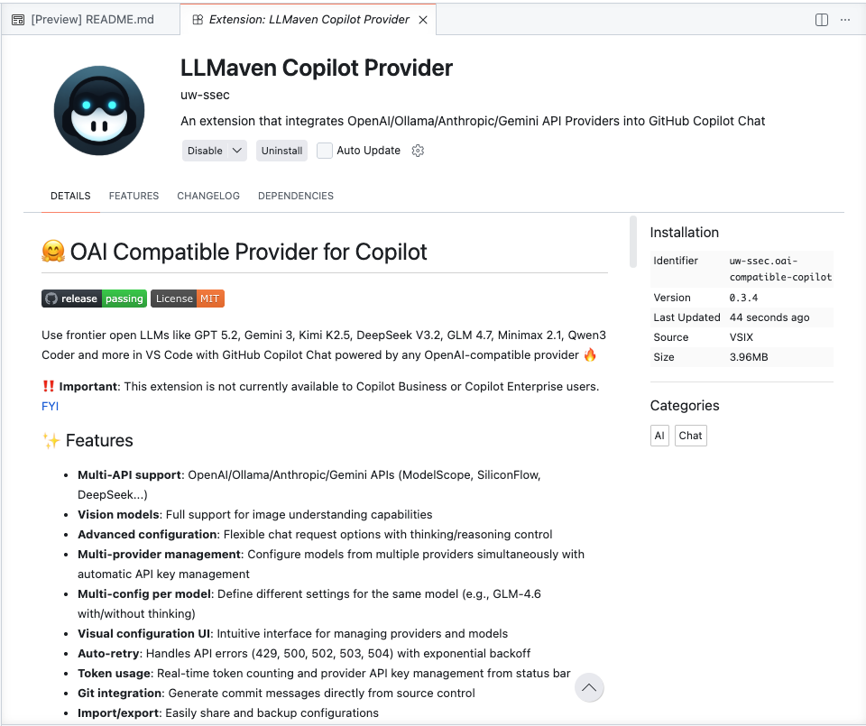
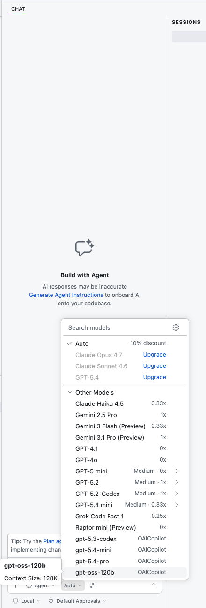
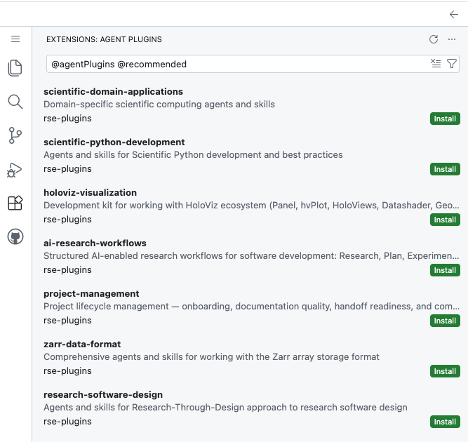

# Getting started

This guide walks through the first-run setup for the NAIRR RSE Plugins Demo sandbox.

The sandbox runs in GitHub Codespaces and provides a configured environment for using GitHub Copilot Chat with the LLMaven / LiteLLM gateway and the UW SSEC RSE Agent Plugins.

## 1. Open the Codespace

Start from the authorized onboarding flow or the repository page, then open a GitHub Codespace for this repository.

During setup, the devcontainer will:

- prepare the Pixi environment
- create a local LLMaven session identifier
- download the pinned LLMaven Copilot Provider VSIX
- verify the VSIX SHA256 against the value committed in this repository
- install the provider extension if it is missing
- configure the provider extension to use the LLMaven / LiteLLM gateway

You may see setup output in the terminal during first launch.

## 2. Understand the sandbox layout

The sandbox has three main pieces:

```text
GitHub Codespaces
  → provides the reproducible development environment

LLMaven Copilot Provider
  → routes Copilot Chat model requests through the LLMaven / LiteLLM gateway

RSE Agent Plugins
  → provide RSE-specific skills, agents, and workflows inside Copilot Chat
```

See the [three-layer sandbox view](assets/sandbox-three-layer-view.png), which shows the RSE Agent Plugins list, the LLMaven Copilot Provider extension, and the Copilot Chat model picker in one VS Code workspace.


In this view:

- the left panel shows recommended RSE Agent Plugins
- the center panel shows the installed LLMaven Copilot Provider extension
- the right panel shows Copilot Chat with OAI-compatible models available through the provider

## 3. Confirm the LLMaven Copilot Provider is installed

Open the Extensions view and search for:

```text
LLMaven Copilot Provider
```

You should see the extension installed.

See the [LLMaven Copilot Provider screenshot](assets/llmaven-copilot-provider.png).



This extension is the gateway-routing layer. It lets Copilot Chat use OAI-compatible model providers through the LLMaven / LiteLLM gateway.

## 4. Confirm Copilot Chat can use an OAI-compatible model

Open Copilot Chat.

In the model picker, OAI-compatible models should appear alongside other available models.

See the [Copilot model picker screenshot](assets/copilot-model-picker.png).



Select one of the OAI-compatible models when you want requests to route through the LLMaven Copilot Provider.

If startup shows the following warning, the provider extension may not be able to authenticate with the gateway:

```text
Warning: OAI_API_KEY is not set.
```

If you see that warning, recreate the Codespace from the authorized onboarding flow.

## 5. Install the recommended RSE Agent Plugins

Open the Extensions view and search:

```text
@agentPlugins @recommended
```

You should see the UW SSEC RSE plugins recommended from the `rse-plugins` marketplace.

See the [recommended RSE Agent Plugins screenshot](assets/recommended-rse-agent-plugins.png).



Install the UW SSEC RSE plugins you want to use. Do not install plugins from unknown marketplaces in this sandbox unless instructed by the demo maintainers.

Recommended plugins may include:

- `scientific-domain-applications`
- `scientific-python-development`
- `holoviz-visualization`
- `ai-research-workflows`
- `project-management`
- `zarr-data-format`
- `research-software-design`

The exact set of recommended plugins may change as the marketplace evolves.

## 6. Try an RSE workflow in Copilot Chat

After installing the plugins, open Copilot Chat and try prompts such as:

```text
Use the scientific-python-development plugin to review this repository for testing, dependency, and API design issues.
```

```text
Use the project-management plugin to assess onboarding and handoff readiness for this repository.
```

```text
Use the research-software-design plugin to identify user, workflow, and design risks in this project.
```

```text
Use the ai-research-workflows plugin to help structure this task into research, planning, experimentation, and implementation phases.
```

Depending on the installed plugin, you may see plugin-provided skills, agents, slash commands, or tools in Copilot Chat.

## 7. Saving work

This repository is intended as a managed sandbox. Demo users should fork the repository if they want to preserve changes.

See:

```text
docs/save-your-work.md
```

## 8. Data and evaluation notes

AI interactions may be routed through the LLMaven / LiteLLM gateway for research and evaluation purposes.

See:

```text
docs/data-collection.md
```

## Troubleshooting

### The LLMaven Copilot Provider extension is missing

Reattach to the Codespace or reload the VS Code window.

If the extension still does not appear, recreate the Codespace from the authorized onboarding flow.

### `OAI_API_KEY` is missing

If startup shows:

```text
Warning: OAI_API_KEY is not set.
```

the provider extension may not be able to authenticate with the gateway. Recreate the Codespace from the authorized onboarding flow.

### RSE plugins do not appear

Check that Agent Plugins are enabled in VS Code settings:

```json
"chat.plugins.enabled": true
```

Then open the Extensions view and search:

```text
@agentPlugins @recommended
```

### Copilot Chat works, but RSE-specific behavior is missing

The provider extension and the RSE Agent Plugins are separate layers:

```text
LLMaven Copilot Provider = model routing
RSE Agent Plugins = RSE workflows
```

If Copilot Chat works but RSE-specific skills, agents, or commands are missing, check whether the RSE Agent Plugins are installed and enabled.
